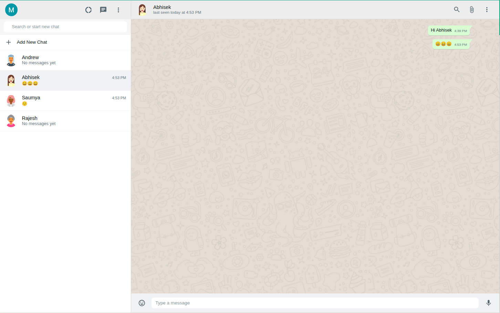
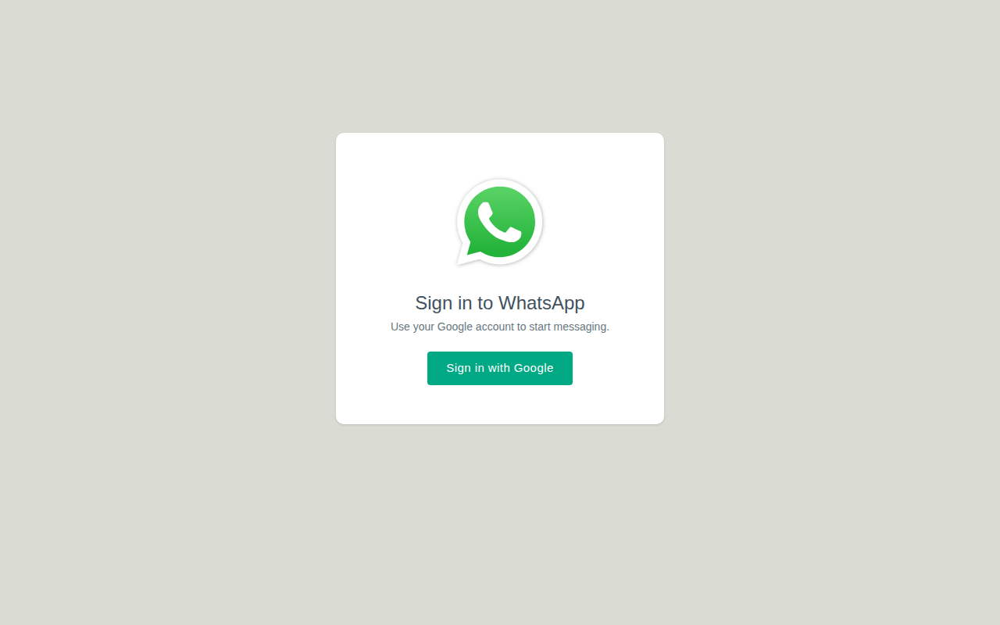

# WhatsApp Clone

A WhatsApp Web clone built with React and Firebase — Google sign-in, real-time
messaging, and the familiar two-pane layout.

**Live demo → [whatsapp-clone-iac.vercel.app](https://whatsapp-clone-iac.vercel.app/)**

---

## Screenshots

### Chat



### Sign in



---

## Features

- **Google sign-in** through Firebase Authentication
- **Real-time messaging** — messages stream in over Firestore `onSnapshot`, no refresh needed
- **Create chat rooms** from the sidebar
- **Search** to filter the chat list by name
- **Emoji picker** with eight categories that inserts at the cursor position
- **Profile panel** showing your name, email, and avatar
- **Stays signed in** across reloads — Firebase Auth restores the session
- **Responsive layout** that goes full-bleed below 1024px

## Tech stack

| | |
|---|---|
| UI | React 17, Material-UI 4 |
| State | Redux |
| Routing | React Router 5 |
| Backend | Firebase 8 — Authentication + Cloud Firestore |
| Tooling | Create React App 4 |
| Hosting | Vercel |

## Getting started

**Requires Node 17 or newer.** The `start` and `build` scripts pass
`--openssl-legacy-provider`, a flag that doesn't exist on older versions — on
Node 16 or below, npm will fail immediately with an invalid-option error.

```bash
git clone https://github.com/Manas-15/whatsapp-clone.git
cd whatsapp-clone
npm install
npm start
```

The app runs at [http://localhost:3000](http://localhost:3000).

### Firebase setup

The project ships with a working Firebase config in
[`src/components/Firebase/firebase.utils.js`](src/components/Firebase/firebase.utils.js).
To point it at your own project, replace the `config` object with the settings
from your Firebase console, then:

1. Enable **Google** under *Authentication → Sign-in method*
2. Create a **Cloud Firestore** database
3. Add your domain under *Authentication → Settings → Authorized domains*

Firestore uses a single `rooms` collection, each room holding a `messages`
subcollection:

```
rooms/{roomId}
  name: string
  messages/{messageId}
    message:   string
    name:      string     // sender's display name
    timestamp: serverTimestamp
```

> **A note on the API key.** A Firebase web API key is a public identifier, not
> a secret, so committing it is expected. It does mean your
> [Firestore security rules](https://firebase.google.com/docs/firestore/security/get-started)
> are the only thing guarding your data — worth reviewing before sharing the
> project widely.

## Available scripts

| Command | What it does |
|---|---|
| `npm start` | Dev server with hot reload |
| `npm run build` | Production bundle in `build/` |
| `npm test` | Test runner in watch mode |

## Project structure

```
src/
├── components/
│   ├── Chat/              Message pane, bubbles, emoji picker
│   ├── Sidebar/           Chat list, search, Sidebarchat/ rows
│   ├── LogIn/             Google sign-in screen
│   ├── Profile-detail/    Profile overlay
│   ├── SignOut-Dropdown/  Header overflow menu
│   ├── Firebase/          Firebase init, auth, Firestore exports
│   └── Redux/             Store, reducers, user actions
└── utils/
    ├── avatar.js          DiceBear avatar URLs, seeded per room
    └── time.js            Timestamp formatting
```

## Deployment

Deployed on Vercel with Create React App's defaults — build command
`npm run build`, output directory `build`. Pushing to `master` triggers a new
deployment.

---

Built by [Manas Pasayat](https://github.com/Manas-15).
